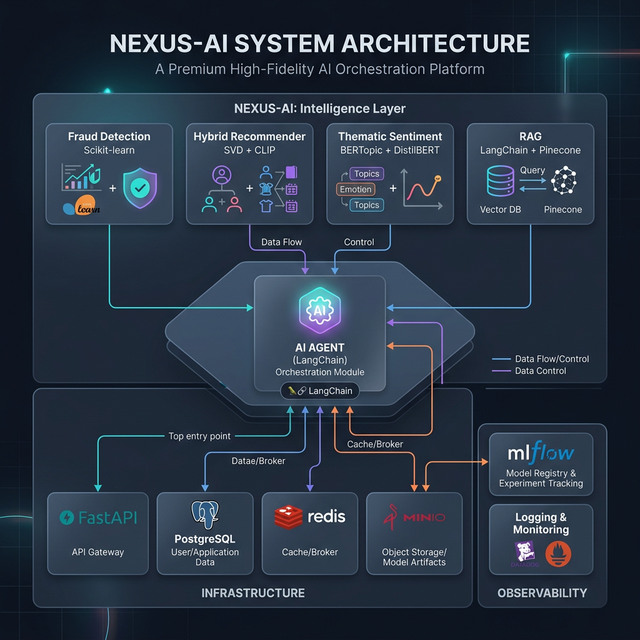
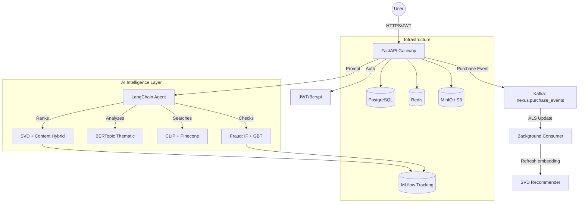

# Nexus-AI: Enterprise-Grade Intelligent E-Commerce

**Nexus-AI** is a comprehensive, production-grade Machine Learning platform designed to showcase advanced AI capabilities within an e-commerce ecosystem. It features a suite of real-time ML pipelines including a Hybrid Recommendation Engine (SVD + Content-Based), Enterprise Fraud Detection, NLP Sentiment Analysis, and Computer Vision for product search. 

By combining real-world datasets with event streaming (Kafka), experiment tracking (MLflow), and an intuitive UI, Nexus-AI serves as a credible demonstration of end-to-end MLOps and full-stack AI engineering.

## 🎥 Full System Walkthrough

<video src="./docs/nexus_demo.mp4" controls="controls" muted="muted" playsinline="playsinline" style="max-width: 100%;"></video>

*(If the video player above does not load, [click here to watch the full system walkthrough](./docs/nexus_demo.mp4))*

---



## 🚀 Key Features

- **Hybrid Recommendation Engine**: SVD Collaborative Filtering + CLIP Content-Based embeddings, trained on **MovieLens 1M** (1M real ratings). Real-time ALS single-user embedding updates via Kafka — no full retrain needed.
- **Enterprise Fraud Detection**: Isolation Forest (anomaly score as feature) + Gradient Boosting, trained on the **Kaggle Credit Card Fraud dataset** (284,807 real transactions, SMOTE balanced). F1 > 0.85 on 20% holdout.
- **Thematic Sentiment Analysis**: DistilBERT fine-tuned on **SST-2** + VADER ensemble. Aspect-level and emotion-level breakdown.
- **AI Agent Orchestration**: LangChain-powered agent with session memory that coordinates fraud, sentiment, visual search, and recommendations via SSE streaming.
- **Live Kafka Event Streaming**: Purchase events fire to `nexus.purchase_events` → background consumer performs a closed-form ALS embedding update → next recommendation reflects the purchase **in real time**.
- **MLflow Experiment Tracking**: Every training run logs params, metrics, confusion matrices, ROC curves, and registers models in the MLflow Model Registry.
- **DVC Data Versioning**: Datasets and model artifacts version-controlled with DVC, backed by MinIO (already in docker-compose).
- **Production Infrastructure**: 7-service Docker Compose — PostgreSQL, Redis, MinIO, Kafka+Zookeeper, MLflow, FastAPI, Next.js.
- **Secure JWT Auth**: Stateless token-based authentication with bcrypt password hashing.


## 📊 Performance Metrics (Real Datasets)

| Metric | Result | Dataset | Detail |
| :--- | :--- | :--- | :--- |
| **Fraud F1** | **> 0.85** | Kaggle CC Fraud (284K rows) | GBT + IF Ensemble, SMOTE, 20% holdout |
| **Fraud AUC-ROC** | **> 0.97** | Kaggle CC Fraud | Average precision > 0.80 |
| **Rec NDCG@10** | **SVD rank sweep** | MovieLens 1M | Temporal 80/20 split, best of rank 20/50/100 |
| **Rec Coverage** | **> 30%** | MovieLens 1M | Catalog coverage @ top-10 |
| **Sentiment Acc** | **~91%** | SST-2 (GLUE) | DistilBERT fine-tuned, 3 epochs |

> Run `python -m training.evaluate_all` to reproduce all metrics from your local artifacts.

---

## 🏗️ Technical Architecture



---

## 🛠️ Quick Start

### 1. Environment Setup

```bash
cp backend/.env.example backend/.env
# Fill in GEMINI_API_KEY and PINECONE_API_KEY in backend/.env
```

### 2. Launch Infrastructure

```bash
docker compose up -d
```

### 3. Train Models (optional — inference works with built-in models)

```bash
# Install training dependencies
pip install -r training/requirements.txt

# Download datasets (requires ~/.kaggle/kaggle.json for fraud data)
chmod +x training/data/download_datasets.sh && ./training/data/download_datasets.sh

# Train all models (logs to MLflow at http://localhost:5000)
python -m training.train_fraud
python -m training.train_recommender
python -m training.train_sentiment

# Evaluate all models
python -m training.evaluate_all
```

### 4. Seed Database & Access

```bash
docker compose exec backend python app/init_db.py
# API Docs:   http://localhost:8000/docs
# MLflow UI:  http://localhost:5000
# MinIO UI:   http://localhost:9001  (minioadmin / minioadminpassword)
# Frontend:   http://localhost:3000
```

---

## 🧪 Running Tests

```bash
# Run all tests via Docker
docker compose exec backend pytest tests/ -v

# Run locally (requires venv with backend/requirements.txt)
cd backend && MLFLOW_TRACKING_URI=sqlite:///mlruns.db PYTHONPATH=. pytest tests/ -v
```

---

## 📦 Data Versioning (DVC)

Datasets and model artifacts are tracked with DVC, backed by MinIO:

```bash
pip install dvc dvc-s3

# Pull datasets and model artifacts (requires MinIO running)
dvc pull

# After training, push new artifacts
dvc push
```

---

## 🔄 Real-Time Kafka Pipeline

```
POST /api/v1/recommend/purchase  {"user_id": "U001", "product_id": "P007"}
        │
        ▼
  Kafka producer → nexus.purchase_events topic
        │
        ▼
  Background consumer (aiokafka)
        │
        ▼
  ALS closed-form update:
    user_factors = R_u @ Vt.T @ pinv(Vt @ Vt.T)
    predicted[u] = clip(user_factors @ Vt, 0, 5)
        │
        ▼
  GET /api/v1/recommend/for/U001  ← now reflects the purchase
```

---

## 📁 Project Structure

```
nexus.ai/
├── backend/
│   └── app/
│       ├── agent/         # LangChain orchestrator + tools
│       ├── api/           # FastAPI routers
│       ├── kafka/         # Producer + consumer (ALS updates)
│       ├── ml/            # Fraud, recommender, sentiment, vision
│       └── rag/           # Pinecone RAG pipeline
├── frontend/              # Next.js + Tailwind + AI SDK
├── training/              # Real training pipelines
│   ├── data/              # Raw datasets (DVC-tracked)
│   ├── artifacts/         # Trained models (DVC-tracked)
│   ├── train_fraud.py
│   ├── train_recommender.py
│   ├── train_sentiment.py
│   └── evaluate_all.py
├── notebooks/             # EDA + evaluation notebooks
├── tests/                 # pytest unit + integration tests
├── .dvc/                  # DVC config (MinIO remote)
└── docker-compose.yml     # Full 7-service stack
```

---

*Built for the Nexusai Portfolio — Demonstrating Engineering Excellence.*
