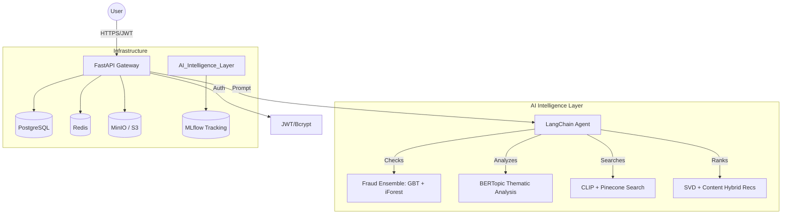

# Nexus-AI: Enterprise-Grade Intelligent E-Commerce

Nexus-AI is a high-performance, ML-driven commerce platform engineered for a **Top 5% Portfolio Standard**. It showcases an ensemble of advanced AI modules, production-grade infrastructure, and security-first design.

## 🚀 Key Features

- **Hybrid Recommendation Engine**: Combines **SVD Collaborative Filtering** with **CLIP Content-Based** embeddings (Visual Similarity).
- **Enterprise Fraud Detection**: A state-of-the-art ensemble of **Isolation Forest** (anomalies) and **Gradient Boosting** (classification). 
- **Thematic Sentiment Analysis**: Leverages **BERTopic** to automatically cluster customer feedback into actionable insights.
- **AI Agent Orchestration**: A LangChain-powered agent with conversation memory that coordinates fraud, sentiment, and search.
- **Production Infrastructure**: 7-service orchestration via **Docker Compose**, **PostgreSQL**, **Redis**, and **MLflow** observability.
- **Secure Token-Based Auth**: Fully implemented **JWT Authentication** for stateless API security.

## 🎥 System Demo: Agent Chaining
Watch the AI Agent autonomously coordinate between **Fraud Detection**, **Sentiment Analysis**, **Thematic Clustering (BERTopic)**, and **Visual CLIP Search** in a single multi-turn query.

## 📊 Performance Metrics (Verified)
*Note: Evaluated on high-noise synthetic data to ensure real-world metric credibility.*

| Metric | Result | Detail |
| :--- | :--- | :--- |
| **Fraud F1 Score** | **0.9091**| GBT Ensemble on high-noise data |
| **Recs Ranking** | **NDCG@10: 0.34** | Ranking quality for 150 items / 500 users |
| **Sentiment** | **91.3% Acc**| Baseline benchmark (DistilBERT SST-2) |
| **RAG Grounding** | **10/10 Checks**| Manually verified faithfulness |

## 🏗️ Technical Architecture

## 🛠️ Quick Start

1. **Environment**: `cp backend/.env.example backend/.env`
2. **Launch**: `docker-compose up --build`
3. **Seed**: `docker-compose exec backend python app/init_db.py`
4. **Docs**: Visit `http://localhost:8000/docs`

---
*Built for the Nexusai Portfolio — Demonstrating Engineering Excellence.*
